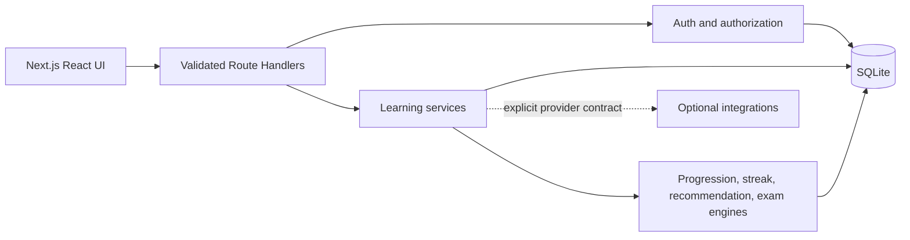

# LevelUp Architect

LevelUp Architect is a local-first, RPG-style adaptive learning platform for Cloud Solution Architects. It removes the daily decision of what to study by combining focus areas, prerequisites, demonstrated mastery, quiz accuracy, confidence, available time, and certification goals into a concrete next quest.

The repository contains a complete end-to-end MVP: secure local accounts, onboarding, adaptive daily/weekly/monthly quests, idempotent XP, levels and tiers, achievements, streaks, skill tracking, certification readiness and evidence, 60-question practice assessments, remediation, and a mentor that works without a paid AI service.

## What works now

- **Authentication and roles:** scrypt password hashing, opaque database-backed sessions, HTTP-only cookies, login throttling, origin checks, and learner/content-reviewer/administrator role support.
- **Adaptive campaign:** ranked focus areas, confidence, 30/45/60-minute study windows, prerequisite gating, weakness/accuracy weighting, and deterministic quest selection.
- **Quest engine:** daily reading + lab + quiz missions, weekly boss battles, monthly raids, official GitHub/Microsoft resources, four-checkpoint guided hands-on field manuals, evidence/reflection capture, and persisted checkpoint/step progress.
- **Progression:** levels 1–100, seven named tiers, configurable XP sources, immutable XP ledger, idempotent completion, daily/weekly/monthly streaks, milestone bonuses, and six seeded achievements.
- **Skill and certification intelligence:** mastery/confidence/accuracy heatmap, ten requested certification paths, calculated readiness, owner-only certificate uploads, and 60-question timed assessments assembled from 100-question rotating banks with weak-topic remediation.
- **Personal mentor:** deterministic local `The Guide` persona grounded in current progress, with an optional explicitly configured OpenAI-compatible provider.
- **Operations:** SQLite migration/seed layer, Docker and Compose, devcontainer/Codespaces, CI, CodeQL, Dependabot, issue forms, and deployment guidance.

## Quick start

### Prerequisites

- Node.js 20.11 or newer (Node.js 22 LTS recommended)
- npm 10 or newer

### Run locally

```powershell
npm install
Copy-Item .env.example .env.local
npm run dev
```

Open <http://localhost:3000>. The database is created and seeded automatically at `data/levelup-architect.db`.

For a fast tour, choose **Explore with demo data** or sign in with:

```text
Email: demo@levelup.local
Password: LevelUpDemo!
```

The demo account is seeded only outside production unless `SEED_DEMO_USER=true` is explicitly set.

### Run with Docker Compose

```powershell
$env:AUTH_SECRET = "replace-with-at-least-32-random-characters"
docker compose up --build
```

The named `levelup-data` volume persists SQLite data across container restarts.

## Commands

| Command | Purpose |
|---|---|
| `npm run dev` | Start the Next.js development server |
| `npm run build` | Create the production standalone build |
| `npm start` | Run a built application |
| `npm run lint` | Run ESLint with zero warnings |
| `npm run typecheck` | Run strict TypeScript checking |
| `npm test` | Run deterministic domain and integration tests |
| `npm run db:seed` | Initialize/migrate and seed the configured database |

## Configuration

| Variable | Required | Description |
|---|---:|---|
| `AUTH_SECRET` | Production | At least 32 characters; protects persisted session-token hashes |
| `DATABASE_PATH` | No | SQLite path; defaults to `./data/levelup-architect.db` |
| `CERTIFICATE_UPLOAD_DIR` | No | Private certificate file directory; defaults to `./data/certificates` |
| `SESSION_COOKIE_SECURE` | No | `false` for local HTTP; `true` for hosted HTTPS |
| `MENTOR_PROVIDER` | No | `local` (default) or `openai-compatible` |
| `MENTOR_API_URL` | For external mentor | Full chat-completions-compatible endpoint |
| `MENTOR_API_KEY` | For external mentor | Provider credential; never expose with a `NEXT_PUBLIC_` prefix |
| `MENTOR_MODEL` | For external mentor | Provider model/deployment name |
| `SEED_DEMO_USER` | No | Set `true` to opt into the known demo account in production |

Missing external mentor settings return an explicit service error. The application does not fabricate a response or silently downgrade after the learner selected an external provider.

## Architecture at a glance



The application uses server-rendered route boundaries plus client-side interaction states. SQL and persistence are isolated under `lib/db`; domain math remains pure and directly testable. Service transactions own completion, XP, skills, streaks, and achievement changes so partial progression cannot be committed.

See:

- [Product requirements and UX](docs/PRODUCT.md)
- [Application, API, and database architecture](docs/ARCHITECTURE.md)
- [Gamification, recommendation, and exam engines](docs/ENGINES.md)
- [Roadmap, sprint plan, and implementation plan](docs/ROADMAP.md)
- [Deployment options and limitations](docs/DEPLOYMENT.md)

## Repository map

```text
app/                    Next.js pages and validated API route handlers
components/             Accessible interactive application UI
lib/auth/               Password, session, role, and throttling services
lib/db/                 SQLite schema, migration, connection, and seed data
lib/domain/             Pure progression, streak, recommendation, and exam logic
lib/integrations/       Future provider contracts (no simulated integrations)
lib/services/           Transactional learning, exam, dashboard, and mentor services
tests/                  Domain and database-backed integration tests
docs/                   Product, technical, engine, roadmap, and deployment docs
```

## Security and data boundaries

- Passwords use Node.js `scrypt` with a unique random salt.
- Session cookies are HTTP-only, `SameSite=Lax`, and `Secure` for configured HTTPS deployments.
- Only session-token hashes are persisted.
- State-changing JSON APIs validate origin and Zod request schemas.
- XP event keys are unique per learner; quest step completion and rewards are atomic.
- Certificate proof accepts magic-byte-validated PDF/PNG/JPEG/WebP files up to 8 MB, is downloaded as an attachment, and is authorized by owner.
- Uploaded proof is learner-attested local evidence, not third-party credential verification. Certification XP is awarded only once per supported credential.
- External links are official seeded resources. No brittle scraping is used.
- Challenge evidence is learner-attested in the MVP. GitHub API verification is an interface, not a claimed live capability.
- SQLite is suitable for local/single-instance operation. Multi-instance production requires PostgreSQL before horizontal scaling.

See [SECURITY.md](SECURITY.md) for reporting and production-hardening guidance.

## Implemented versus roadmap

Implemented behavior is fully local and persisted. The following are deliberately **contracts and roadmap items**, not fake integrations: GitHub activity verification, Microsoft Learn catalog synchronization, guilds and leaderboards, shared challenges, reviewed marketplace publishing, AI submission/repository/architecture review, organization analytics, and enterprise administration. Their boundaries are defined in `lib/integrations/contracts.ts` and [docs/ROADMAP.md](docs/ROADMAP.md).

## GitHub Pages

GitHub Pages can host only a static informational/export experience. It cannot run this application’s authentication, route handlers, SQLite database, mentor provider, or transactional progression. Use App Service, Container Apps, a container host, or a Node.js server for the full product.

## Contributing and license

Read [CONTRIBUTING.md](CONTRIBUTING.md), [CODE_OF_CONDUCT.md](CODE_OF_CONDUCT.md), and [SECURITY.md](SECURITY.md). The project is available under the [MIT License](LICENSE).
