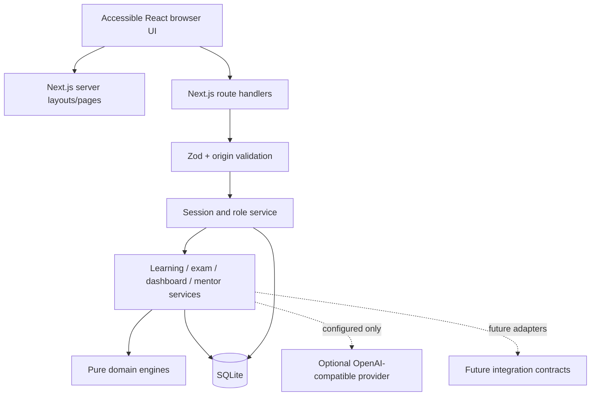
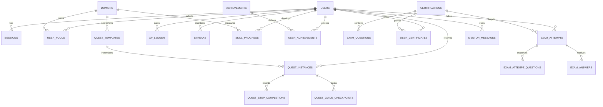
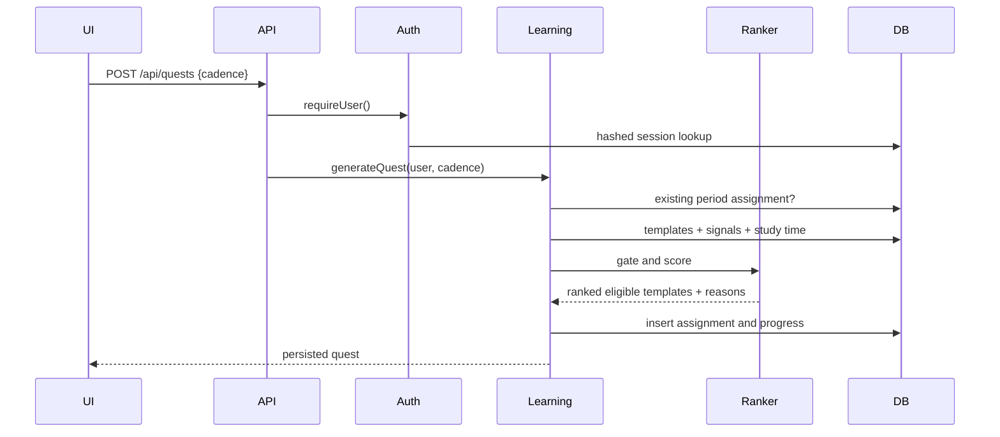
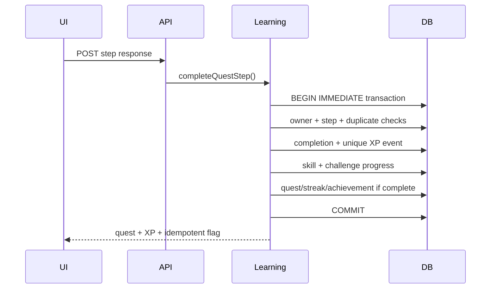

# Application Architecture, API, and Data Design

## Context

LevelUp Architect is a Next.js application with interactive React surfaces and server route handlers. SQLite provides zero-service local persistence. Domain logic is TypeScript, framework-independent where practical, and designed to move behind PostgreSQL-backed repositories without changing product semantics.

The architecture optimizes the MVP for:

- immediate Windows/macOS/Linux operation;
- honest local capability with no paid dependencies;
- transactional progression and repeatable tests;
- a clear path from one learner/instance to multi-user hosted operation;
- explicit boundaries around future external integrations.

## System view



## Runtime boundaries

| Layer | Location | Responsibility |
|---|---|---|
| Routes and layouts | `app/` | URL structure, authentication redirects, metadata, API HTTP status |
| UI | `components/` | Interaction, accessibility, loading/empty/error states |
| Request schemas | `lib/validation.ts` | Untrusted request validation and normalization |
| Auth | `lib/auth/` | Password derivation, login throttling, opaque sessions, user/role guards |
| Services | `lib/services/` | Authorization-aware use cases and database transactions |
| Domain | `lib/domain/` | Pure math, ranking, scoring, period behavior, catalog definitions |
| Persistence | `lib/db/` | Connection, pragmas, schema migration, seed materialization |
| Integrations | `lib/integrations/` | Provider contracts only; no success-shaped stubs |

API handlers remain intentionally thin. They validate transport concerns, require a session, call one service use case, and translate known errors into structured responses.

## Key architecture decisions

### Next.js App Router

Server layouts enforce account/onboarding boundaries while client components provide responsive interaction without a separate SPA/API repository. Route handlers use platform `Request`/`Response` patterns and typed service calls.

### SQLite with explicit SQL

SQLite minimizes local prerequisites and enables Docker volume persistence. SQL is isolated in database and service modules rather than spread through UI. Tables use ordinary relational keys, check constraints, join tables, and JSON text only for stable authored structures (steps, prerequisites, question options, result snapshots). This maps directly to PostgreSQL `jsonb` and enum/check constraints.

`better-sqlite3` provides synchronous transactions with a small operational surface. The application enables foreign keys, WAL for file databases, and a write wait timeout.

### Opaque sessions instead of JWT

Random session tokens are returned only in HTTP-only cookies. The database stores an HMAC hash, user ID, and expiration. Server-side revocation is immediate and roles are read from the current user record. JWT complexity and stale embedded authorization are avoided.

### Deterministic local adaptation

The recommendation engine is explicit and testable. A model is not necessary to produce adaptive value. Future machine-learned ranking can compare against this baseline in shadow mode.

### Transaction ownership

Services own transactions because they understand use-case atomicity. Repository wrappers can be added during PostgreSQL migration, but splitting a progression transaction across isolated repository commits would be incorrect.

## Authentication and authorization

### Passwords

Passwords are validated to 8–128 characters and derived with Node.js `scrypt` and a random 16-byte salt. Encoded values include algorithm, salt, and hash. Verification uses constant-time comparison. Password hashes remain valid when the independent session-signing secret rotates.

Production refuses to hash session tokens without an `AUTH_SECRET` of at least 32 characters. Development uses a clearly scoped fallback to keep local setup easy.

### Sessions

- 256-bit random opaque token.
- HMAC-SHA-256 token hash persisted; raw token exists only in the cookie.
- 14-day absolute expiration.
- HTTP-only, `SameSite=Lax`, path `/`, and `Secure` for configured HTTPS deployments. Local HTTP explicitly sets `SESSION_COOKIE_SECURE=false`.
- Logout deletes the session row and cookie.
- Expired sessions are not accepted.

Scheduled expired-session cleanup is a small post-MVP operational task.

### State-changing requests

JSON APIs require `application/json`, parse malformed JSON explicitly, validate with Zod, and reject a supplied cross-origin `Origin`. Cookie same-site policy is an additional control. Internet deployments should add proxy-level request limits and distributed throttling.

### Roles

`learner`, `content_reviewer`, and `administrator` are database-constrained values. `requireRole` is the authorization primitive. Current learner routes use `requireUser`; future review/admin handlers must use `requireRole` in addition to role-specific data filters. UI visibility must never be the only authorization check.

## Database schema



### Table catalog

| Table | Purpose and important constraints |
|---|---|
| `schema_migrations` | Ordered applied migration versions |
| `users` | Local identities, constrained role, onboarding state, study window |
| `sessions` | Hashed opaque tokens, user FK, expiration indexes |
| `domains` | Ten ordered learning domains |
| `user_focus` | Ordered learner/domain priorities; unique rank per learner |
| `xp_config` | Operator-configurable amounts by source type |
| `quest_templates` | Authored cadence, domain, duration, difficulty, mode, prerequisites, steps |
| `quest_instances` | Learner assignment with unique learner/cadence/period |
| `quest_step_completions` | Idempotent quest/step completion, score, response/evidence payload |
| `quest_guide_checkpoints` | Ordered persisted progress inside guided hands-on steps |
| `challenge_progress` | Learner/template percent, status, evidence URL, notes |
| `xp_ledger` | Immutable reward event with unique learner/event key |
| `streaks` | Current/best count and last period for daily/weekly/monthly |
| `achievements` | Badge catalog |
| `user_achievements` | Idempotent learner/badge unlock |
| `skill_progress` | Mastery, confidence, attempts, correct answers, completed steps |
| `certifications` | Requested Microsoft/GitHub roadmap and official URLs |
| `user_certification_progress` | Cached readiness/confidence/status and optional target date |
| `user_certificates` | Owner-scoped earned/expiry metadata and private local file reference; one active proof per roadmap credential |
| `exam_questions` | Original practice prompts, type, difficulty, domain, options, answer, explanation, and active/retired state |
| `exam_attempts` | Server-timed lifecycle and immutable result snapshot |
| `exam_attempt_questions` | Exact ordered question set per attempt |
| `exam_answers` | Selected answer and correctness by attempt/question |
| `mentor_messages` | Learner and mentor transcript with provider provenance |

### Authored JSON

- `quest_templates.prerequisites_json`: `DomainSlug[]`
- `quest_templates.steps_json`: ordered `QuestStep[]`
- `exam_questions.options_json`: ordered `string[]`
- `exam_attempts.result_json`: immutable scored result and topic summary
- `quest_step_completions.response_json`: answer/evidence/reflection payload

All JSON is authored or validated before persistence and parsed to explicit TypeScript types. PostgreSQL migration should use `jsonb` with application and database constraints where useful.

### Migration strategy

`SCHEMA_VERSION` and SQLite `user_version` protect against opening a database
newer than the application. The initial schema runs in a transaction and ordered
migrations then add guided checkpoint persistence (version 2), certificate
evidence (version 3), and retirement state for authored exam questions (version
4):

```text
if version < 2: run migration 2; record; set user_version
if version < 3: run migration 3; record; set user_version
if version < 4: run migration 4; record; set user_version
```

Never edit an already released migration. Upgrade fixtures validate migrations
against representative prior-version databases.

## API design

All responses are JSON. Errors use:

```json
{
  "error": {
    "code": "MACHINE_READABLE_CODE",
    "message": "Human-readable explanation",
    "details": {}
  }
}
```

`details` is optional and used for validation structure. Unexpected errors are logged server-side and return a generic message.

| Method | Route | Auth | Behavior |
|---|---|---|---|
| `GET` | `/api/health` | Public | Database liveness and timestamp |
| `POST` | `/api/auth/register` | Public | Create learner and issue session |
| `POST` | `/api/auth/login` | Public | Throttled login, starter quest generation, session |
| `POST` | `/api/auth/logout` | User | Revoke session and clear cookie |
| `GET` | `/api/auth/me` | Optional | Current session user or null |
| `POST` | `/api/onboarding` | User | Save focus/confidence/time and generate eligible quests |
| `GET` | `/api/dashboard` | User | Aggregated campaign snapshot |
| `GET` | `/api/quests` | User | Learner quest list |
| `POST` | `/api/quests` | User | Generate cadence quest for current period |
| `GET` | `/api/quests/:id` | Owner | Quest and persisted steps |
| `POST` | `/api/quests/:id/steps/:stepId` | Owner | Transactional/idempotent completion |
| `PATCH` | `/api/quests/:id/steps/:stepId/checkpoints/:checkpointId` | Owner | Persist or reopen ordered guided progress |
| `PATCH` | `/api/challenges/:templateId` | User | Persist percent/evidence/reflection |
| `GET` | `/api/certifications` | User | Roadmap and calculated readiness |
| `POST` | `/api/certifications/:code/evidence` | User | Upload/replace owner-only PDF or image proof and record certification |
| `GET` | `/api/certifications/evidence/:id/download` | Owner | Download private proof as a non-sniffable attachment |
| `POST` | `/api/exams` | User | Create timed attempt and question snapshot |
| `GET` | `/api/exams/:attemptId` | Owner | Active or submitted attempt |
| `POST` | `/api/exams/:attemptId/submit` | Owner | Deadline check, scoring, remediation, readiness |
| `GET` | `/api/mentor` | User | Recent mentor transcript |
| `POST` | `/api/mentor` | User | Local or configured-provider response |

### Ownership

Quest, exam, and certificate-evidence lookups include both resource ID and
current user ID. A valid resource ID belonging to another learner returns not
found. This avoids cross-learner disclosure and prevents insecure direct object
references.

## Critical sequences

### Quest generation



### Step completion



### Exam submission

The server compares its current time to stored `started_at + duration_minutes`; client countdown is presentation only. Exact attempt questions are loaded, submitted IDs/options are validated, and answers/result/skills/readiness/achievement commit in one transaction.

### Certificate evidence

The multipart route checks the session and request origin, validates credential
metadata, rejects files over 8 MB, and identifies PDF/PNG/JPEG/WebP content from
magic bytes rather than trusting the extension. A random server-side name is
written under the configured private upload directory. The database transaction
upserts one active proof per learner/credential, marks roadmap progress certified,
awards the unique certification XP event, and unlocks Certification Warrior.
Downloads require ownership and force attachment handling with `nosniff`.
Replacing proof cleans up the superseded file; production backups must keep the
database and certificate directory together.

## Error and state design

- `400`: validation, incomplete exam, invalid answer.
- `401`: authentication required or invalid credentials.
- `403`: origin/role denial.
- `404`: missing or non-owned resource.
- `409`: duplicate state conflict, expired attempt, no eligible content.
- `413`: certificate upload request exceeds the hard byte limit.
- `415`: unsupported request or certificate media type.
- `429`: login throttling.
- `5xx`: provider/runtime/configuration failures.

Client surfaces preserve the last good dashboard where possible and expose retries for load failures. Mutation failures do not optimistically retain success.

## Integration boundaries

`lib/integrations/contracts.ts` defines:

- `ActivityVerificationProvider` for GitHub repositories, commits, pull requests, issues, and Actions;
- `LearningCatalogProvider` for reviewed Microsoft Learn/catalog resources;
- `SubmissionReviewProvider` for challenge/repository/architecture/document review;
- `OrganizationAnalyticsSink` for approved aggregated events.

No default implementation returns `verified: true`. Provider setup must define credentials, scope, rate limits, consent, webhook/poll strategy, replay protection, audit records, and manual-review fallback.

Guilds, team/certification leaderboards, shared challenges, and marketplace workflow need first-class tables and authorization; they should not be improvised as JSON fields on users.

## Scalability path

### Phase 1: local/single instance

- SQLite WAL and private certificate files on one persistent local/container volume.
- One Node.js instance.
- Process-local login throttle.
- Synchronous database calls.

### Phase 2: hosted multi-user

- PostgreSQL with pooled connections and explicit transaction isolation.
- Distributed rate limiting (for example Redis or platform gateway).
- Background jobs for content review dates, integration verification, and analytics.
- Blob/object storage for submissions rather than arbitrary local files.
- Structured audit events and retention controls.

### Phase 3: organization platform

- Organization/tenant membership and policy tables.
- Entra ID or GitHub OIDC/SSO adapters.
- Per-organization encryption and integration credentials.
- Event-driven verification and analytics.
- Read replicas/search indexes for reporting.
- Consent and privacy controls for mentor and performance data.

Domain calculations and event keys remain stable through these phases.

## Testing strategy

- Pure tests: level curve, tiers, streak periods/bonuses, ranking/gates, readiness, exam scoring, Zod schemas.
- In-memory SQLite integration tests: step idempotency, transactional completion, streak persistence, timed exam scoring, review, and readiness.
- CI: install, lint, strict typecheck, all tests, production build.
- CodeQL: JavaScript/TypeScript analysis on changes and weekly schedule.

Future: route-handler integration tests, browser accessibility tests, migration fixtures, concurrency tests against PostgreSQL, and property tests for progression/event invariants.
